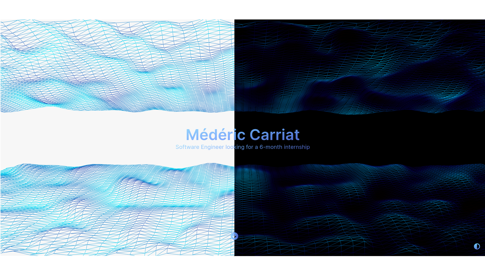
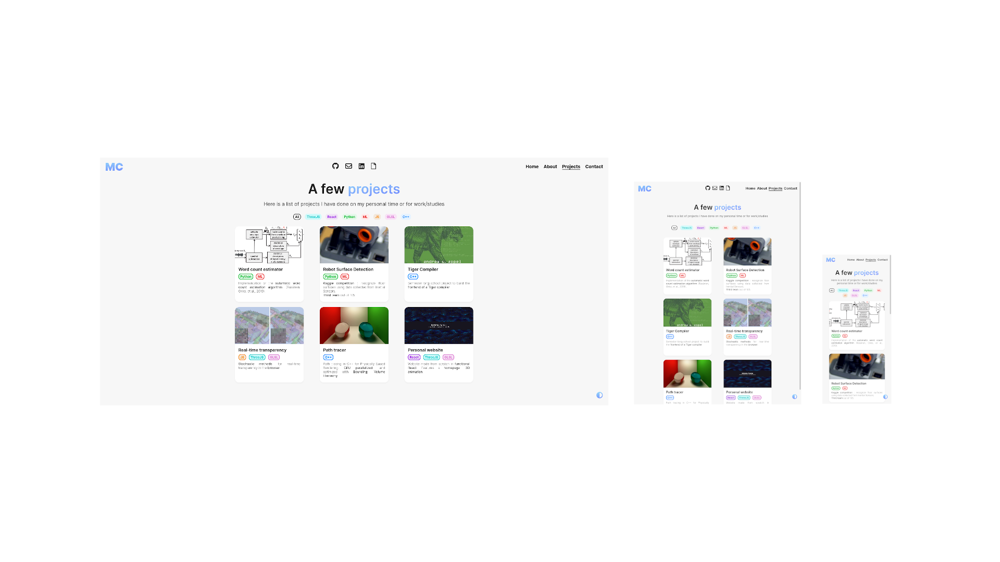

<div align="center">
  
</div>
<h1 align="center">
  <a href='https://medericcarriat.com/'>medericcarriat.com</a>
</h1>
<p align="center">Simple yet fully featured portfolio website.</p>

<h2 align="center">
  
  <br>
</h2>

## ⭐ Features
- Single page app with snap-scroll effect
- 3D animation as homepage
- Timeline to display experiences
- Projects table with tags and filters
- Light and dark themes
<div align="center">  <br></div>
- Fully responsive
<div align="center"><br>  <br><br></div>
- Made only with React and Sass, no library

## Getting started

### Requirements
To try the website on your own machine you will need both [Git](https://git-scm.com) and [Node.js](https://nodejs.org/en/download/).

### Setup

In a terminal :
```bash

# Clone the repository
$ git clone https://github.com/MedericCar/portfolio.git
$ cd portfolio

# Install the dependencies
$ npm install

# Launch the development server
$ npm start
```

From there the website should be accessible through http://localhost:3000/.

### Edition

Should one want to modify the data and colors of the website : 
- colors for both light and dark themes are in `src/app.scss`
- data for the timeline and the projects table are stored in separate objects in `src/data.js` (colors used there should be defined in the aforementioned palettes)
- contact messaging is handled with [EmailJS](https://www.emailjs.com/), IDs should be replaced in `src/components/contact/Contact.jsx`
- socials and resume URL are in `src/components/contact/Socials.jsx`

## Acknowledgments
Special thanks to [Lama Dev](https://www.youtube.com/channel/UCOxWrX5MIdXIeRNaXC3sqIg) for a great [tutorial](https://www.youtube.com/watch?v=7WwtzsSHdpI) which I used as a basis for this project.
